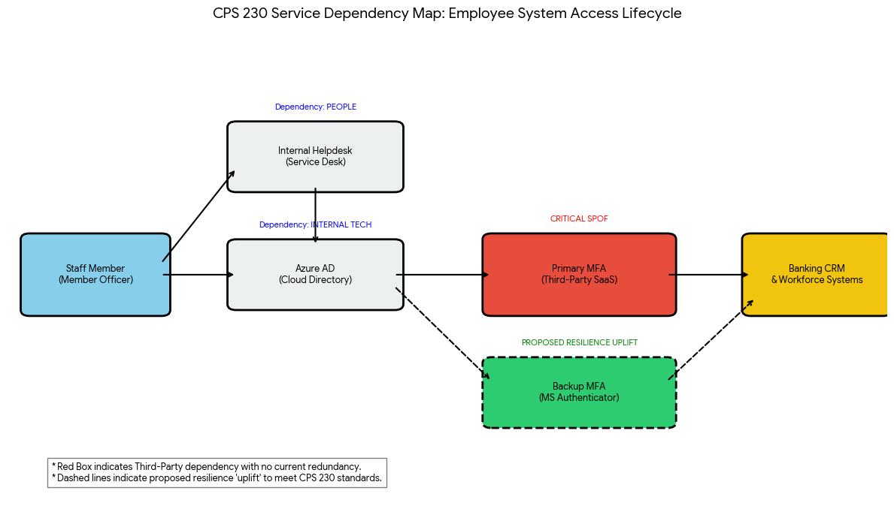

### **📂 Portfolio Project: CPS 230 Critical Business Service Map**

**Project Title:** Service Dependency Mapping & Resilience Analysis: Employee System Access (IAM)  
**Critical Business Service:** Workforce System Availability (Identity & Access Management)  
**Regulatory Focus:** APRA CPS 230 (Operational Risk Management)

---

#### **1. The Service Dependency Map**
To ensure TMBL can maintain operations during a disruption, I mapped the critical path required for a staff member to log in and serve a customer.

| Category | Component | Role in the Service |
| :--- | :--- | :--- |
| **People** | Service Desk Analysts | Manual reset/override of credentials. |
| **Technology** | Azure AD (Cloud) | Primary identity directory and authentication engine. |
| **Third-Party** | MFA Provider (e.g., Okta/Duo) | Required second factor for all external/remote access. |

---

#### **2. Identification of Single Points of Failure (SPOFs)**

Through this mapping, I identified a critical **Third-Party SPOF**:
* **The Vulnerability:** TMBL relies exclusively on a single third-party provider for Multi-Factor Authentication (MFA). 
* **The Risk:** If this provider suffers a regional outage (as seen in recent global SaaS incidents), 100% of remote staff and 60% of office-based staff would be unable to access the Core Banking System.
* **Impact:** This would immediately breach the bank's **Impact Tolerance** for "Member Support Availability," as the Contact Centre would go dark.

---

#### **3. Resilience "Uplift" Proposal**
To align with CPS 230 requirements for **Operational Resilience**, I proposed a dual-path authentication strategy:

* **Short-Term Fix (Managerial Control):** Establish a "Break-Glass" procedure where the Service Desk can issue time-limited hardware tokens (YubiKeys) for critical roles during a SaaS MFA outage.
* **Long-Term Uplift (Technical Control):** Implement a secondary, geographically diverse authentication path (e.g., Microsoft Authenticator as a backup to the primary provider). 
* **Result:** This ensures that even if the third-party provider fails, the "Critical Business Service" (Access) remains functional, maintaining a "Maturity Level 3" stance under the ASD Essential Eight.

---

#### **4. Regulatory Alignment**
* **APRA CPS 230:** Satisfies the requirement to map dependencies and manage **Service Provider Risk**.
* **APRA CPS 234:** Ensures "timely change to access" and robust authentication remains active even during degraded states.

---

